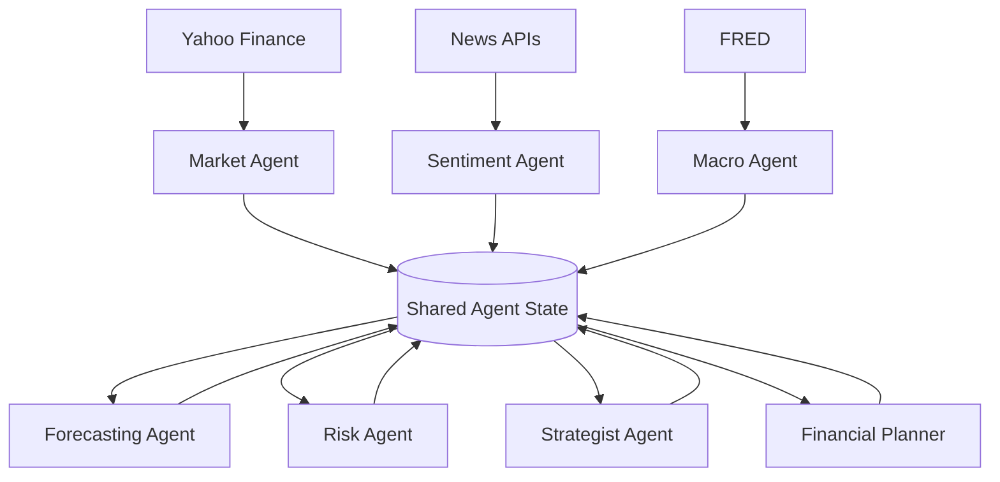

# GenAI Multi-Agent Hedge Fund

_Agents for market forecasting, strategy, and personal financial planning._

This project explores how **agentic workflows**, time-series models and LLM reasoning can work together for more transparent investing and goal-based planning. It was built as part of the University of Chicago MS-ADS program and implements a **7-agent async pipeline** that integrates Yahoo Finance, FRED, and news APIs, then explains its decisions in plain language.

---

## Key Features

- **7 coordinated agents with shared state**
  - Market
  - Sentiment
  - Macro
  - Forecasting (Prophet + ARIMA fallback)
  - Risk
  - Strategist (LLM or rules)
  - Financial Planner
- **Ensemble forecasting** with volatility-aware confidence and graceful fallbacks when optional dependencies are missing.
- **Personal financial planning**:
  - Monthly contributions.
  - Projected portfolio growth.
  - Monte Carlo–based success probability for reaching targets.
- **Explainability**:
  - Human-readable rationales behind buy/sell/hold decisions.
  - Transparent description of planning assumptions.
- **Live demo app** (Streamlit):  
  `https://a2amultiagenthedgefund-7jxenesgsrcamwahzhhbuf.streamlit.app`

---

## Agents

### 1. **Market Agent**
Pulls OHLCV data from Yahoo Finance and computes:

- Daily returns.
- Volatility measures.
- Basic technical indicators (RSI, simple support/resistance levels).

---

### 2. **Sentiment Agent**
Processes recent news headlines and produces:

- Headline-level polarity scores.
- Aggregated sentiment index + headline volume.
- Heuristic fallback when sentiment APIs are unavailable.

---

### 3. **Macro Agent**
Builds a macroeconomic context layer using FRED data:

- GDP, CPI, unemployment.
- Interest rates / yield curve.
- Market stress indicators (VIX when available).

---

### 4. **Forecasting Agent**
Runs an ensemble of forecasting models:

- **Prophet**
- **ARIMA:** fallback when Prophet or certain inputs are missing.

The agent then:

- Combines forecasts into an ensemble prediction.
- Adjusts confidence based on volatility.

---

### 5. **Risk Agent**
Uses combined signals from market, macro, and forecasts to:

- Penalize forecasts during high-volatility regimes.
- Estimate downside risk.
- Produce a risk-adjusted confidence score.

---

### 6. **Strategist Agent**
Determines the overall investment recommendation.

Modes:

- **LLM mode** (GPT-4) if an LLM key is available.
- **Rule-based fallback** when LLM reasoning is disabled.

Outputs:

- Buy / Sell / Hold recommendation.
- Clear natural-language rationale grounded in shared state.

---

### 7. **Financial Planner Agent**
Provides long-term planning insights:

- Monthly contribution planning over a target horizon  
- Projected future portfolio value  
- Monte Carlo success probability  
- “Plan Sharpe” summary (risk-adjusted quality measure)

---

## System Architecture

The system is a multi-agent pipeline built around a **shared Agent State**. Each agent reads what it needs, writes its outputs, and passes control to the next stage.

### High-Level Data & Agent Flow

---

## Data & Preprocessing

### **Market Data (Yahoo Finance)**
- Daily OHLCV data pulled and aligned to a standardized trading calendar  
- Handling of missing days, NaNs, and other irregularities  
- Computation of returns, volatility metrics, and technical indicators  

### **Macro Data (FRED)**
- Pulls selected macroeconomic series such as GDP, CPI, unemployment, and interest rates  
- Normalizes and aligns update frequency and timestamps to market data  

### **Text Data (News)**
- Cleans and normalizes news headlines  
- Applies sentiment polarity scoring  
- Produces ticker-level aggregated sentiment weighted by headline volume  

---
